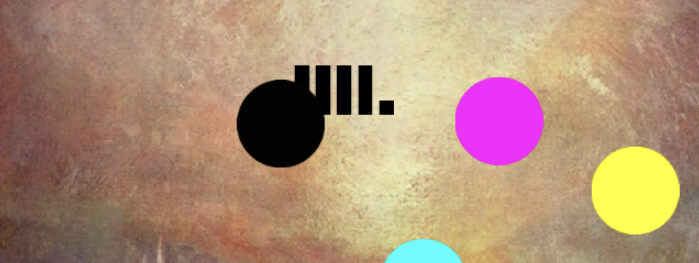

# *Sound System I*

## [Play Online](https://www.pippinbarr.com/sound-system-i/web/) (HTML5, not mobile-friendly)
## ~~[Download for Mac](https://github.com/pippinbarr/sound-system-i/releases/tag/mac)~~
## ~~[Download for Windows](https://github.com/pippinbarr/sound-system-i/releases/tag/windows)~~

## Description
Originally released on 3 February 2015, *Sound System I* was written in [Haxe](http://haxe.org/) using the [HaxeFlixel](http://www.haxeflixel.com/) library. The images used are by William Turner. The sounds used are a combination of Audacity-generated tones and synth and drum-machine samples.

## Press
*Sound System I* was covered by [Kill Screen](https://killscreen.com/previously/articles/pippin-barr/).

## Documentation
* Check out the [code repository](https://github.com/pippinbarr/sound-system-i) (includes the original HaxeFlixel project and a new one I've been using to update the exports to HTML5, Mac, and Windows)
* Read the [process documentation](../process/) to get some insight into what I was thinking about while making the game
* Download the [the original .swf file](https://github.com/pippinbarr/sound-system-i/releases/tag/swf/) if you want

## License
