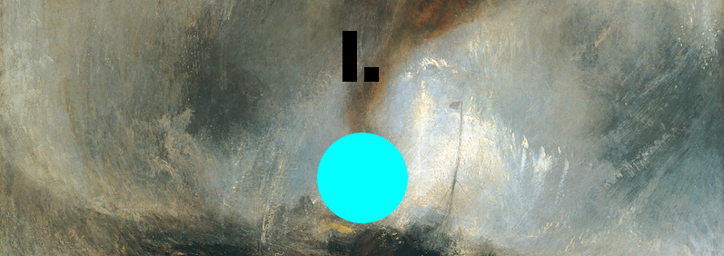

# Blog

Herein lie blog post(s) I wrote about the game on my public-facing blog at the time.

## Caged Music (2015-01-07)

For the last couple of days I&#8217;ve been making a little musical thing I&#8217;m now calling _Sound System I_. The game originally came about after reading about Duchamp&#8217;s work &#8220;[Pharmacy](http://www.toutfait.com/unmaking_the_museum/Pharmacy.html)&#8220;, which I visualised completely differently to how it actually looks. In fact, I was thinking more about [this kind of image](http://sigliopress.files.wordpress.com/2011/10/seydel-book-of-ruth-also-a-pharmacology.jpg) created by Robert Seydel (itself a tribute to Duchamp!). Specifically, I&#8217;m struck by the power of a very defined coloured shape, like a cyan circle,  on top of a more whimsical/romantic painted image. I just like it.

So I wanted to make a game with that as the aesthetic and set about asking myself how it would be a &#8220;game&#8221;, or at least what you might _do_ in it. I ended up trying to keep it very simple, just basic physical manipulation of the circle, bouncing it around. The idea expanded to have four parts, with increasing numbers of circles (one in the first, two in the second, etc.). And then I wanted there to be sound effects &#8211; because sound is great, and I don&#8217;t use it enough.

And then at some point I realised there wasn&#8217;t a scrap of &#8220;game&#8221; involved &#8211; I was just making a series of musical toys. I played more determinedly with different &#8220;instrument&#8221; designs and obtained various sample sets to give them their own sounds. So that, in the end, I have four little instruments which you can set in motion (zero friction, zero gravity, 100% restitution) and then listen to the music they all make together. And that&#8217;s what this thing is. Quite far away from what I&#8217;d initially thought I&#8217;d make, but still completely true to the original aesthetic, and oddly pleasing to listen to (for me).

Which brings me rather belatedly to the title of this post, which is a desperately wonderful reference to the work of John Cage, which I&#8217;ve been reading about recently. In particular, I&#8217;ve been interested in his thoughts of making music that allows for &#8220;nature&#8221; in it &#8211; so the use of silence, for example (infamously), or of randomness &#8211; an attempt to efface the creator in favour of music that almost &#8220;makes itself&#8221;.

So _Sound System I_ is a very minor attempt to engage with these ideas in the end. In particular it&#8217;s a &#8220;naturalistic&#8221; system, using the box2d physics engine to calculate what trajectories and collisions will take place and thus to create the music. Because even simple systems like these ones because swiftly unpredictable, there this &#8220;natural&#8221; idea as well &#8211; or at least the complexity of it. Additionally, nature sneaks in (perhaps more here than in musical composition proper) because of the &#8220;skill&#8221; required to &#8220;throw&#8221; one of the circles in a desired path. Often when you try to throw a circle in a straight line at a particular speed, for instance, to make a regular percussive beat, you&#8217;ll manage to get it slightly off and the beat will drift with the physics.

All quite pleasing. I&#8217;ll release it in the next couple of days I imagine. Working on the (awful) UI.
