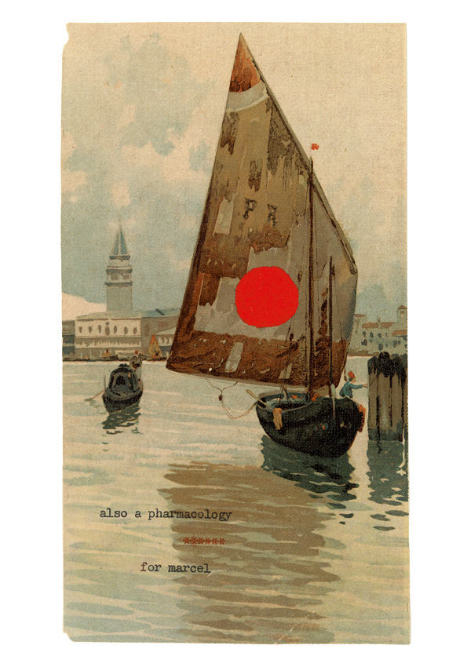

# Design Journal

These are various "journal entries" made in *Evernote* which was my note-taking software at the time I made the game.

## Early notes (n.d.)

Pharmaceuticals

Four games set on the Turner prints I got from Kalu and leveraging the primary coloured shapes (or all circles?)

Use physics for at least one of them.

Do they need to actually be games?

Just play around with what could be done with shapes on those backgrounds.

Puzzles in sequence with 1, 2, 3, 4 dots

I
Have to play a tune by throwing the ball against the "walls" of the painting to play tones in the correct sequence. (How do you know the sequence? Maybe it just plays a nice tune and then stumbles when you get it wrong - e.g. trial and error -- or maybe it's a recognisable song?)

II

III

IIII

Robert Seydel’s “also a pharmacology for marcel"

## "Tah" "Doo" (2015-01-07)

Add some kind of “made a sound” flash nicer than flicker.

Switch IIII to be the tone scale and III to be the drums.

Add quickfades from menu to screens

Tweak the speeds. (especially the tone scale, which would make it easier to see what’s happening.,

Add quickfade from screens to menu

Add the proper backgrounds

Don’t make the pulse work in the zoomed out screen

Make the screen buttons not appear and not work in the menu (and viceversa)

Make the screen buttons smaller.

Add interface elements

   Ability to select the screen to edit (I guess just any click that’s not on a button)

   Typography (just sans-serif?) of I, II, III, IIII, aligned to be over each ball. Or maybe just serif? (Leave it there while playing around?)

   Ability to reset a screen

   Ability to go back to the menu.

   Ability to stop/play a screen (what will this mean in the various cases??? hm. Nothing, or you keep note of position and velocity for each ball on mouse release for the “final” adjustment and reset it to that? Too complex to make sense?) — more primitive would be just to stop/start motion entirely. Maybe that’s actually more intuitive and better?

   Stop/start for menu

Make the buttons pretty

Think about interface-y bullshit like not being able to “stop” something if it was just reset and so on? Or fuck that? 

NOPE Maybe also make the constant beat tones follow a different curve.

NOPE Don’t start the time-based ones until you move them? (e.g. to have silence until you start playing with them)

Fix the UI rectangles which are not working for non-I

SEEMS TO “JUST" BE A STANDALONE PLAYER BUG? Investigate mouse slowdown

Add preloader
